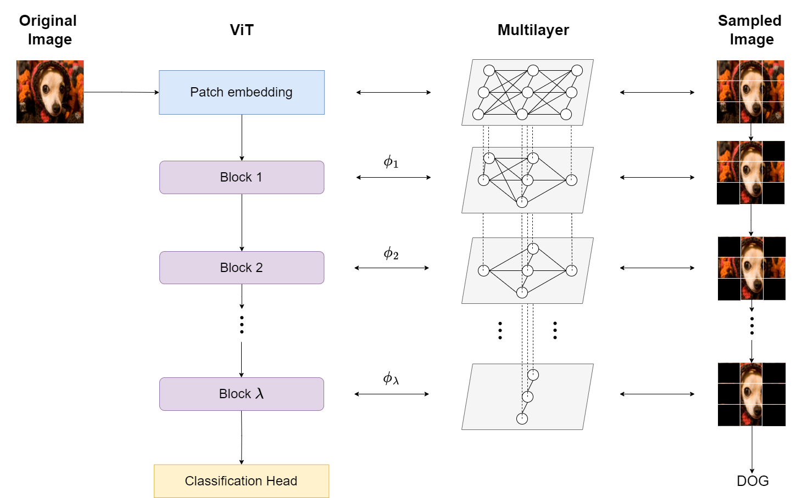

# ViT-Visual-Interpretability

This is the official implementation of the paper: TRAM.

## Abstract




## Usage

This repository can be directly downloaded and executed locally. The required libraries are displayed in Section [Requirements](#requirements)


## Parameters 
In the **Usage_sample** file the user can modify the following parameters:

### Initialization parameters

### Call Parameters


## Requirements <a name="requirements"></a>

In our notebook we used the following libraries:
```
PIL=9.2.0  
scipy=1.9.3  
transformers=4.30.2  
torch=2.1.2+cu121  
torchvision=0.16.2+cu121  
sklearn=1.4.1.post1  
numpy=1.24.4  
pandas=2.1.4  
matplotlib=3.8.2
seaborn=0.13.1  
```


## Citation

If you use this model for your research please cite our paper.